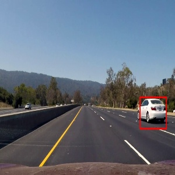

 <h1>Car Detection</h1> 

---

This document has been compiled to summarize the methods I followed to complete the project. The project includes the following files

* VehicleDetectionPipeline.py- This contains the implementation of thealgorithm

* output.avi - Output Video generated by the program

* README.md - This current file, that talks about the project

* image_files - This directory contains the images for this file

<h2> Implementation </h2>
<h3> Data Extraction </h3>
The Data provided had both Car and non car images. They were taken from the GTI vehicle image database and the KITTI vision benchmark suite. I plotted the data count to see if I was dealing with a balanced dataset. I had 8792 car images 8968 non-car images. Hence I did not include any data augmentation steps. The data extraction can be seen in lines 263 and 264 in VehicleDetectionPipeline.py. Here is the dataset visualized.

 !(image_files/data_set_.jpg data)

<i>data</i>

<h3> Training a Classifier</h3>
<h4> Feature Extraction: </h4>
Before the Feature extraction takes place the images are converted to YCrCb color space from the BGR format. This can be seen in the line 74 in function extract_features in the code file.An example of a normal image converted to YCrCb space can be seen below.

<i> YCrCb image 

* Spatial Features: To include the spatial features the given image is converted into 16x16 image and the resized image is flattend out to get the individual vector. The function bin_spatial (lines 34 -38) in the code does this.

* Color Histogram Features : To take into account the color information the YCrCb color converted image is split into individual channels and the histogram of each image is taken. The histogram is taken with 16 bins.All the histograms are concatenated into a single vector. The function color_hist (lines 42 -50) in the code does this.

* HOG Features : The Histogram of Oriented gradients is calculated for every image. The HOG features are calculated with 9 orientation bins, 2 pixels per cell and 2 cells per block. The HOG features are converted to single dimensional vector. The HOG feature calculation takes place in the function get_hog_features from line (14-31). The HOG is visualized as below.

<i> HOG image 
</i>

The above mentioned three features are considered. They are all single dimensional vectors. They are concatenated to obtain a single dimensional vector of length 6108. The entire process happens in the function extract features in VideoDetectionPipeline from lines 53 -101.

<h4> Training:</h4>
The features are obtained for both the car and the non-car features. They are normalised and the labels for the same are also created 1 for cars and 0 for non-cars. The data is also split into training and testing data with the training data taking up-to 80% of the data. The data is also shuffled to prevent the classifier building up bias towards ordering. This can be seen in the code from lines 283 to 312

A linear support vector machines SVM is built with trained with the data. An accuracy of over 99% percent was achieved on the data set. The classifier and the normalizer information are stored so that the program doesn't train every time it is run as it can use the saved model. This can be seen in the lines 314 to 325 in the code.

<h3> Detecting Vehicles: </h3>
The Video is loaded and the processing is done frame by frame. To identify the car I used a sliding window technique. A window of a particular sized slides of the image and sends it to the classifier to detect if it is a car or not. This is done for multiple scales. I used  in total 4 scale with window_sizes of (50,50),(78,78),(100,100),(150,150). The sliding of the windows happens only in the lower half of the image since it is unlikely that we will find cars in the sky or the tree tops.The overlap between the sliding windows is kept at 80%. The windows for all the scales are generated. This is implemented in the slide_window function from lines 104 - 140 in the code file.     

Once the windows are generated the image from that patch is then converted to a 64x64 image. This image is then color transformed into the same YCrCb space. This is then followed by taking the spatial, Color histogram and the HOG features as done with the training data and the this is concatenated into a single vector. 

Once the feature for the particular patch is generated it is sent to the classifier which then predicts if the vector is indeed a car or not. The windows in which the classifier returns a positive car result is saved in a list of hot windows.

The above procedures are done in the single_image_features function and the search_winodows function that is located in the code file from 163-240 lines. The Search area is indicated below by the green area.

<i> Searching image 
</i>

With the hot windows or the detected windows now available we can draw all the windows on the image. This is done by the draw_boxes function located in lines 153 - 161 in the code file. An example of the detected windows drawn can be seen below.

<i> hot windows image 
</i>

To eliminate the false positives I created a heat map from the detected windows. The logic that follows this is that false positives appear in only certaing windows and not in all scales thus creating only a few hot windows for the region whereas many windows are seen for the true positives. Thus, By making each window add heat or weight to a null image and using a threshold to remove the weak spots we can eliminate the false positives. We can create a single bounding box from the multiple bounding boxes from the heat map. All this is done using the functions add_heat, apply_threshold, draw_labeled_bboxes from lines 242 to 271. 

The heatmap visualized is shown below

<i> heatmap 
</i>

The final output

<i> output image 
</i>

<h2> Conclusion: </h2>
The pipeline for vehicle detection worked fairly well. There were some instances of false positives. Another thing I noted was as I increased the number of scales for the windows to be searched for the computing time increased propotionally. This also happened when I increased the overlap percentage. This is slightly computationally intensive. In order to make a readily deployable model we can consider using multi-threading so the windows being searched can be done concurrently.s